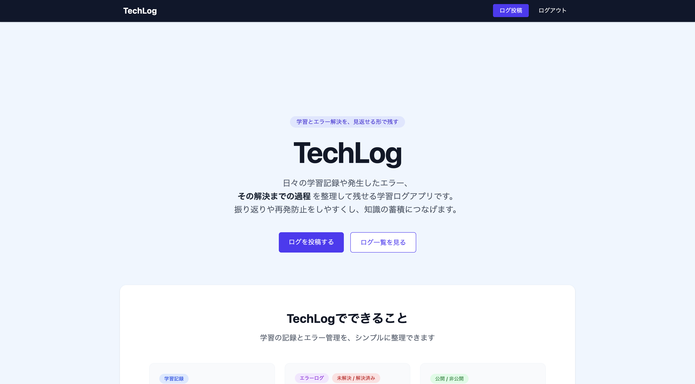
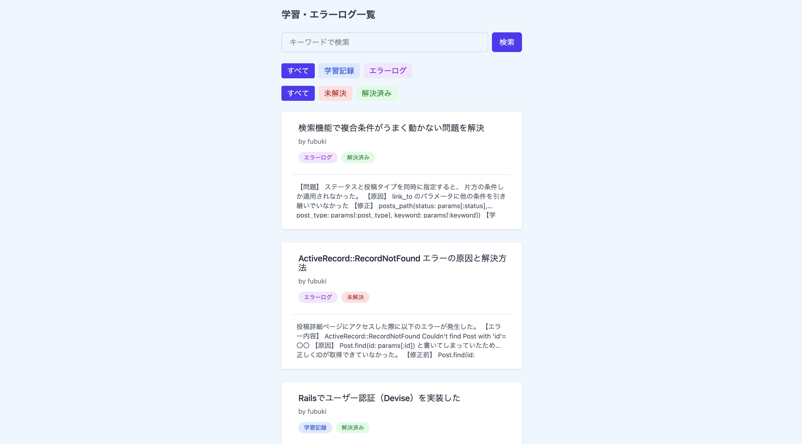
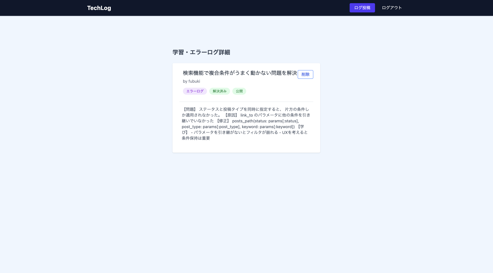
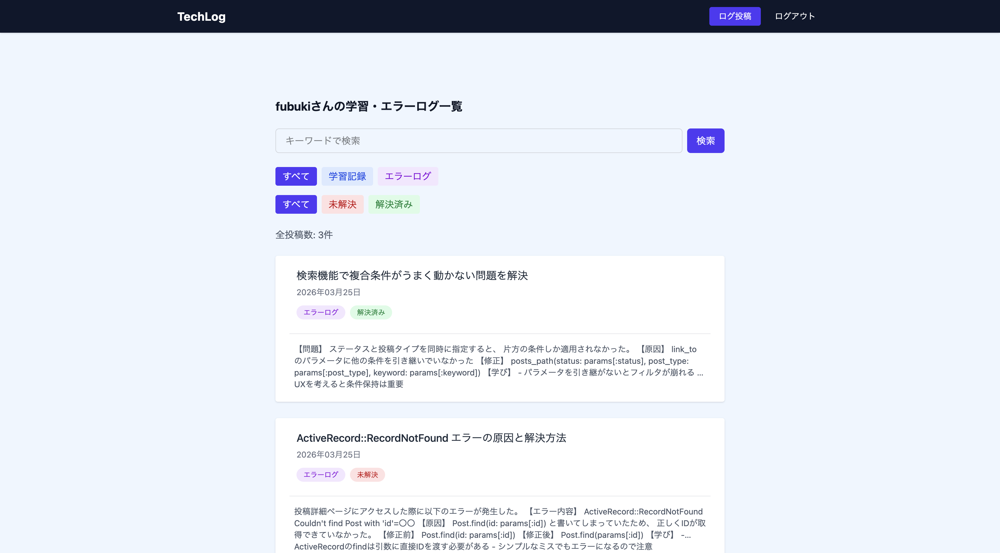

# TechLog

## 📝 概要
TechLogは、プログラミング学習における「学習記録」と「エラーログ」を一元管理できるWebアプリケーションです。

特に「未解決のエラー」を可視化し、効率的な振り返りと問題解決を支援します。

---

## 🎯 作成背景
プログラミング学習を進める中で、

- エラーの内容や解決方法を記録しても、後から見返しづらい
- 未解決のエラーが埋もれてしまう
- 学習内容とエラーが混在し、整理しづらい

といった課題を感じました。

そこで本アプリでは、

- 学習記録とエラーログを分けて管理
- 解決状況（未解決 / 解決済み）を可視化
- 検索・フィルタで必要な情報にすぐアクセス

できるようにすることで、**実用的なログ管理アプリ**として開発しました。

---

## ✨ アプリの特徴

- 学習記録とエラーログを一元管理
- 「未解決のエラー」にフォーカスした設計
- シンプルなUIで継続しやすい
- 複合検索により過去のログを素早く振り返り可能

---

## ⚙️ 主な機能

### 投稿機能
- 学習記録 / エラーログの投稿
- タイトル・本文の入力

### 投稿タイプ管理
- 学習記録とエラーログを分類

### ステータス管理
- 未解決 / 解決済みの管理

### 公開設定
- 投稿の公開 / 非公開の切り替え

### 投稿一覧表示
- 最新順での表示
- 投稿タイプ・ステータスをタグ形式で表示

### 投稿詳細表示
- 詳細情報の表示
- 投稿者のみ削除可能

### 🔍 検索機能
- タイトル・本文を対象としたキーワード検索

### 🎯 フィルタ機能
- 投稿タイプ（学習記録 / エラーログ）で絞り込み
- ステータス（未解決 / 解決済み）で絞り込み

### 🔗 複合検索
- キーワード × 投稿タイプ × ステータスを組み合わせた検索が可能

### 👤 マイページ
- ユーザーごとの投稿一覧表示
- マイページ内でも検索・フィルタが可能

---

## 🛠 使用技術

- Ruby 3.3.10
- Ruby on Rails 7.1.6
- PostgreSQL
- Tailwind CSS
- Devise（認証機能）

---

## 📸 画面イメージ

### トップページ

### 投稿一覧

### 投稿詳細

### マイページ

---

## 💡 工夫した点

- 投稿タイプ（学習記録 / エラーログ）とステータス（未解決 / 解決済み）を組み合わせた複合検索機能を実装
- 検索・フィルタ条件を保持することで、UXを損なわない設計にした
- 投稿タイプやステータスをタグ形式で表示し、視認性を向上
- 学習ログとエラーログを分離し、「未解決の課題」を明確に把握できる設計にした

## 🚀 今後の改善予定

- タグ機能の追加
- コメント機能の実装
- 未解決エラーの優先表示
- UI/UXのさらなる改善
- お気に入り機能
